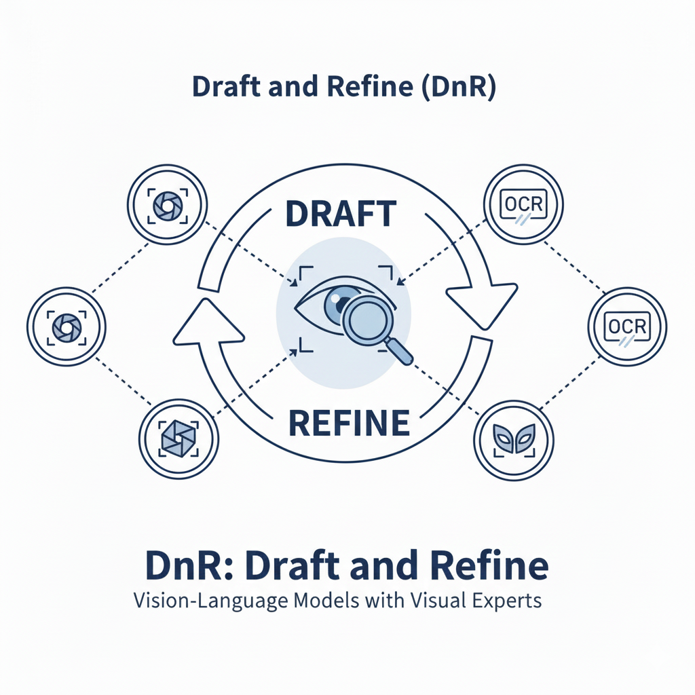
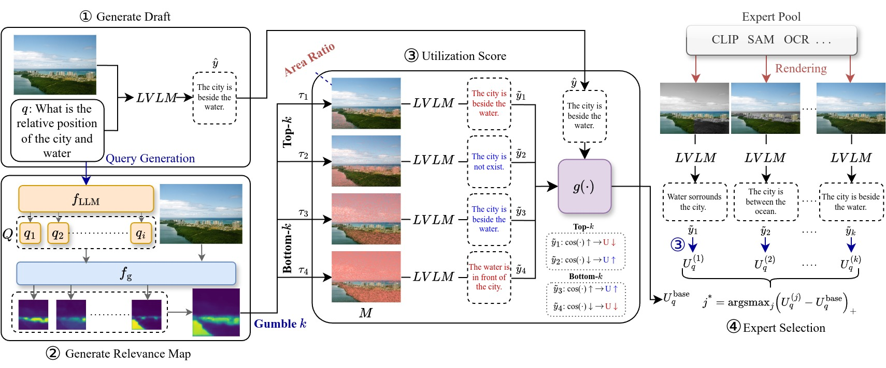
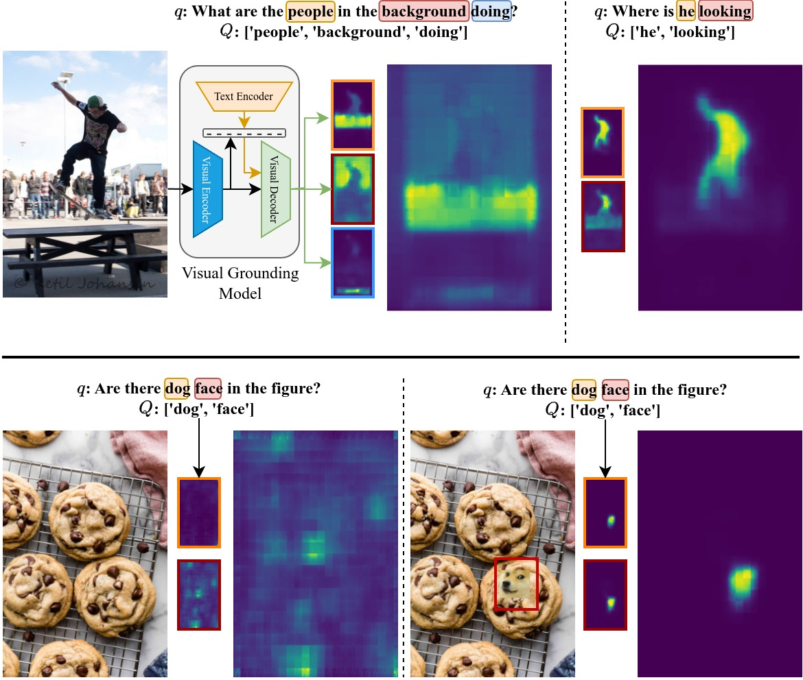

<h1 align="center">
DnR: Draft and Refine with Visual Experts
<br>
<sub> Accepted to CVPR 2026 Highlight🔥 </sub>
</h1>

<p align="center">
  
</p>

<p align="center">
<a href="https://arxiv.org/abs/2511.11005">
  
</a>


</p>


# ✨ DnR Extraction Guide

This document summarizes environment preparation, dataset configuration, and extraction procedures for queries and relevance maps.

<p align="center">
  
</p>

# 🌟 Environment Setup

Set up the conda environment.

```bash
conda create -n dnr python==3.12
conda activate dnr
pip install -r requirements.txt
```
Use the ChatGPT API for hallucination checks. To do this, execute the following:
```
export OPENAI_API_KEY="sk-proj-..."
```


# 🗂 Config Setup

Specify all dataset paths and evaluation files inside:

```
configs/data.json
```

The file should include:

• Root paths for each dataset  
• Evaluation file paths when required  

| Dataset | Link |
|-----|------|
| **VQAv2** | [Official](https://visualqa.org/) • [HuggingFace](https://huggingface.co/datasets/HuggingFaceM4/VQAv2) |
| **VizWiz** | [Official](https://vizwiz.org/tasks-and-datasets/vqa/) • [Kaggle](https://www.kaggle.com/datasets/ingbiodanielh/vizwiz) |
| **GQA** | [Official](https://cs.stanford.edu/people/dorarad/gqa/) • [HuggingFace](https://huggingface.co/datasets/lmms-lab/GQA)
| **TextVQA** | [Official](https://textvqa.org/dataset/) • [HuggingFace](https://huggingface.co/datasets/facebook/textvqa) |
| **OCR-VQA** | [GitHub](https://ocr-vqa.github.io/) • [HuggingFace](https://huggingface.co/datasets/howard-hou/OCR-VQA)
| **VCR** | [Official](https://visualcommonsense.com/) 
| **VSR** | [GitHub](https://github.com/cambridgeltl/visual-spatial-reasoning) • [HuggingFace](https://huggingface.co/datasets/juletxara/visual-spatial-reasoning)
| **OK-VQA** | [Official](https://okvqa.allenai.org/) |
| **A-OKVQA** | [GitHub](https://github.com/allenai/aokvqa) • [HuggingFace](https://huggingface.co/datasets/HuggingFaceM4/A-OKVQA) |
| **SQA** | [Official](https://scienceqa.github.io/) • [HuggingFace](https://huggingface.co/datasets/derek-thomas/ScienceQA) |
| **MME** | [HuggingFace](https://huggingface.co/datasets/lmms-lab/MME) |
| **MMBench** | [GitHub](https://github.com/open-compass/MMBench) |
| **SEED-Bench** | [GitHub](https://github.com/AILab-CVC/SEED-Bench) • [HuggingFace](https://huggingface.co/datasets/AILab-CVC/SEED-Bench-2) |
| **HaloQuest** | [Github](https://github.com/google/haloquest) • [HuggingFace](https://huggingface.co/datasets/johko/HaloQuest)
| **MMHalBench** | [HuggingFace](https://huggingface.co/datasets/Shengcao1006/MMHal-Bench) |


# 🔍 Extract Query for VQA

This stage is required before relevance map extraction for VQA tasks.

**Supported datasets**

```
vqav2, vizwiz, gqa, textvqa, ocrvqa, vsr, vcr, okvqa,
aokvqa, sqa, mme, mmbench, seedbench, haloquest, mmhalbench
```

**Run the extractor**

```bash
python extract_query.py --dataset "DATASET" --llm_device auto
```

**Arguments**

• llm_device auto uses all available GPUs  
• Supported LLMs are:

```
['llama-3-8b', 'llama-3-70b']
```

**Output**

Queries are saved under:

```
root/query_simple
```


# 🎯 Extract Relevance Map (VQA)

<p align="center">
  
</p>

Requires queries to be extracted beforehand.

```bash
python extract_r_map.py --dataset "DATASET"
```

**Output directory**

```
root/clipseg_maps
```


# 🖼 Extract Relevance Map for Captioning

Query extraction is not required for captioning tasks.

**Supported datasets**

```
cococaption, nocaps, flickr
```

**Run**

```bash
python extract_r_map_caption.py --dataset "DATASET"
```

**Output directory**

```
root/clipseg_maps
```


# RUN


# 📂 Repository Structure
    DnR
    ├── main.py
    ├── main_caption.py
    ├── extract_query.py
    ├── extract_r_map.py
    ├── extract_r_map_caption.py
    ├── parser.py
    ├── utils.py
    ├── configs
    │   └── data.json
    ├── dataset
    │   ├── getter.py
    │   ├── collate_fns.py
    │   ├── vqav2.py
    │   ├── ...
    │   └── ...
    ├── evaluate
    │   ├── getter.py
    │   ├── evaluate_vqav2.py
    │   ├── ...
    │   └── ...
    ├── models
    │   ├── experts
    |   │   ├── getter.py
    |   │   ├── loader.py
    |   │   ├── predict.py
    │   |   └── rendering.py
    │   ├── llm
    |   │   ├── getter.py
    |   │   ├── loader.py
    |   │   ├── idefics_predict.py
    |   │   ├── ...
    │   |   └── ...
    │   ├── vlm
    |   │   ├── predict.py
    │   |   └── rendering.py
    │   └── distance_model.py
    ├── process
    │   ├── build_query.py
    │   ├── mask.py
    │   ├── rm.py
    │   ├── uq_caption.py
    │   └── uq.py
    ├── Readme.md

- Each main function only references the directory's *getter*, and the getter loads functions for each dataset and model.

# 📂 RUN

## HyBrid Masking
```
python main.py --dataset "DATASET" --vlm "VISION LANGUAGE MODEL" --dnr
```
```
python main_caption.py --dataset "DATASET" --vlm "VISION LANGUAGE MODEL" --dnr
```
## Top-k faithful
```
python main.py --dataset "DATASET" --vlm "VISION LANGUAGE MODEL" --dnr --mask_func topk --uq_func relevance_faithfulness --uq_num_masks 16 --uq_area_ratio 0.05
```
```
python main_caption.py --dataset "DATASET" --vlm "VISION LANGUAGE MODEL" --dnr --mask_func topk --uq_func relevance_faithfulness --uq_num_masks 16 --uq_area_ratio 0.05
```
## Bottom-k fidelity
```
python main.py --dataset "DATASET" --vlm "VISION LANGUAGE MODEL" --dnr --mask_func bottomk --uq_func relevance_fidelity --uq_num_masks 16 --uq_area_ratio 0.75
```
```    
python main_caption.py --dataset "DATASET" --vlm "VISION LANGUAGE MODEL" --dnr --mask_func bottomk --uq_func relevance_fidelity --uq_num_masks 16 --uq_area_ratio 0.75
```

`--cache_dir` specifies where all HuggingFace models are stored locally so the system does not re-download VLMs or experts every time. 

`--vlm` selects which vision-language model to load among 'idefics', 'pali', 'instructblip', 'llava', 'qwen_vl', 'cogvlm', or 'minigptv2'. 

`--vlm_device` defines the GPU used to run the main VLM.

`--dnr` enables the Draft-and-Refine pipeline, activating expert extraction, relevance estimation, masking, and refinement steps. 

`--experts` defines which expert models will be used such as GroundingDINO for grounding, SAM for segmentation, DepthAnything for depth estimation, and MDETR for multimodal detection. 

`--expert_device` selects which GPU the experts run on. 

`--rendering_mode` controls how the expert output is rendered into masks or overlays such as 'gray' filling, 'blur', 'black' or 'white' masking, or 'highlight' mode that emphasizes detected regions.

`--dist_model` selects the distance model used to compute representation shift for uncertainty and utilization scoring. Typically this is CLIP (VQA) or SBERT (Caption) for cosine distance comparisons. 

`--dist_device` assigns the GPU used for the distance model.

`--dataset` chooses the evaluation dataset among many VQA and multimodal benchmarks such as VQAv2, VizWiz, GQA, TextVQA, OK-VQA, A-OKVQA, SQA, VCR, VSR, MME, MMBench, SeedBench, HaloQuest, or MMHalBench. 

`--limit` restricts how many samples are evaluated, which is useful for quick debugging. 

`--data_path` points to the JSON file that contains dataset paths. 

`--mask_func` controls which masking strategy is applied when generating relevance-based masked images. topk keeps only the most important patches, bottomk keeps the least important, and hybrid mixes both to capture complementary signal. 

`--uq_func` determines how uncertainty or utilization is computed. relevance_faithfulness measures the drop in VLM confidence when important regions are masked, relevance_fidelity measures the shift caused by expert guidance, and hybrid combines both for stability. 

`--uq_num_masks` sets how many random masks are sampled when estimating variance-based uncertainty. 

`--uq_area_ratio` defines how much of the image area is preserved or removed during masking. 

`--uq_alpha` is a weighting factor for hybrid uncertainty that adjusts how much faithfulness contributes relative to fidelity. 


# 📖 Citation

If you use this repository or find it helpful in your research, please cite the following work.

```bibtex
@article{jeong2025draft,
  title={Draft and Refine with Visual Experts},
  author={Jeong, Sungheon and Masukawa, Ryozo and Park, Jihong and Yun, Sanggeon and Huang, Wenjun and Chen, Hanning and Imani, Mahdi and Imani, Mohsen},
  journal={arXiv preprint arXiv:2511.11005},
  year={2025}
}
```


# 🙌 Acknowledgment
We sincerely thank all dataset creators and model authors for making their resources publicly available.  This project is made possible by the dedicated efforts of the research community and the open source ecosystem.


### 👥 Contributors
I would like to express my sincere gratitude to the two individuals who assisted me with the code implementation.

- Ryozo Masukawa: https://github.com/RyozoMasukawa
- Jihong Park: https://github.com/JihongPark-Moloco
